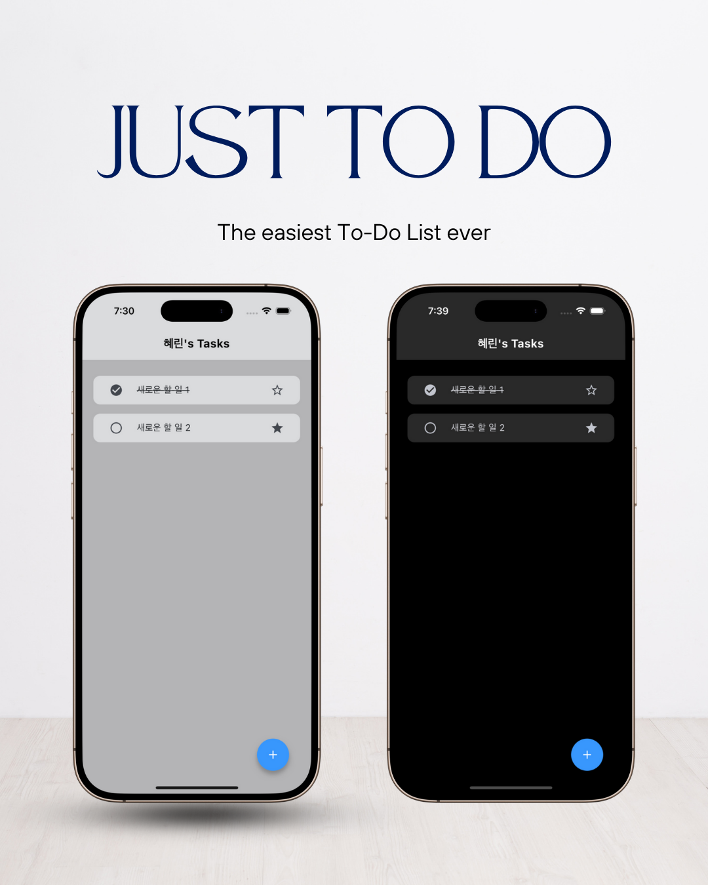
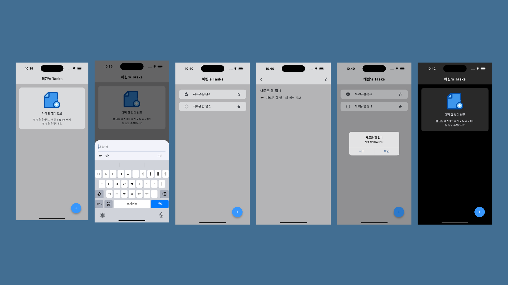
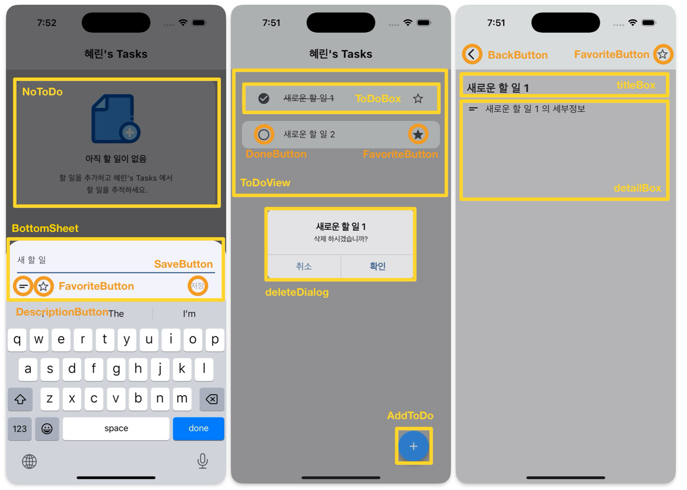

<h1 align="center">
Just To Do
</h1>

  

## 🔖 프로젝트 개요
### “Just To Do" 는 누구나 손쉽게 사용 가능한 To Do List 입니다.

#### 'Just To Do'는 다음과 같은 분들을 위해 탄생되었습니다.

> 해야 할 일들이 정리되지 않아 머릿속이 복잡한 분들
> 

> 간단하게 할 일 목록을 만들고, 완료하고, 삭제하고 싶은 분들
> 

> 복잡한 구조 없는 심플한 투두 리스트를 찾고 있는 분들
> 

      

## 🎨 앱 디자인 설계

  

 

## 📌 주요 기능
1. 제목과 세부 내용(선택)을 작성해 To Do 생성
2. To Do 목록 확인
3. To Do 를 눌러 세부 내용 확인
4. To Do 완료 여부 표시
5. To Do 즐겨찾기 여부 표시
6. To Do 를 길게 눌러 삭제 

 

## 📂 프로젝트 구조

lib/ 
 ㄴ main : 메인 실행 파일 
 ㄴ theme : 앱 전체의 테마 지정 (라이트/다크 모드 지원) 
 ㄴ pages/ 
     ㄴ home_page    : 앱 실행 시 첫 화면 
     ㄴ todo_detail_page    : To Do 의 제목과 세부 내용을 확인할 수 있는 화면 / titleBox, detailBox 
 ㄴ widgets/ 
     ㄴ add_todo     : AddTodo, addToDo() 
     ㄴ bottom_sheet    : BottomSheet 
     ㄴ delete_dialog   : deleteDialog(), deleteToDo() 
     ㄴ no_todo     : NoToDo 
     ㄴ todo_box    : ToDoBox 
     ㄴ todo_view   : class ToDoEntity, List<ToDoEntity> list, ToDoView 
     ㄴ buttons/ 
         ㄴ back_button     : BackButton 
         ㄴ description_button  : DescriptionButton, DescriptionField 
         ㄴ done_button     : DoneButton 
         ㄴ favorite_button     : FavoriteButton 
         ㄴ save_button     : SaveButton, saveToDo(), snackBar() 
 
assets/ : 앱 내에서 사용된 이미지 파일 
README.md : 프로젝트 설명 문서 

 

## 🧱 위젯 구조

  

 

## 📝 커밋 컨벤션

- feat: 새로운 기능 추가
- fix: 버그 수정
- docs: 문서 수정
- style: 코드 포맷팅, 세미콜론 누락 등
- refactor: 코드 리팩터링
- test: 테스트 코드 추가
- chore: 빌드, 패키지 매니저 등 환경 설정
